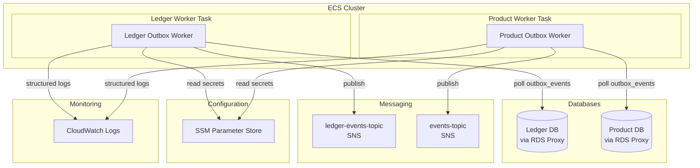
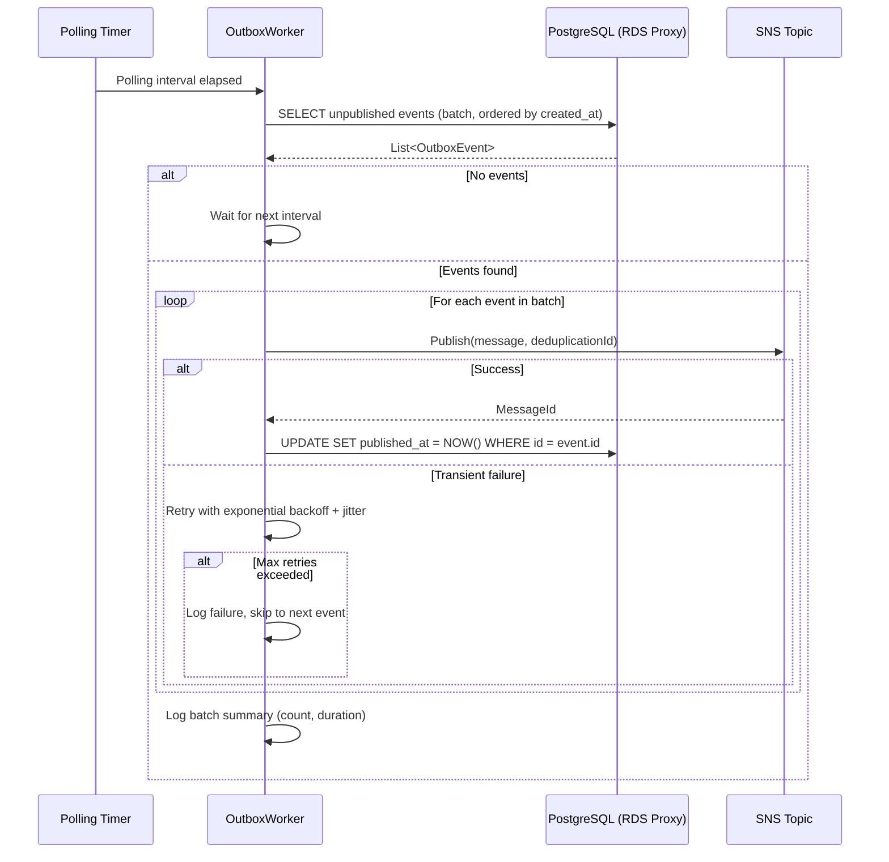
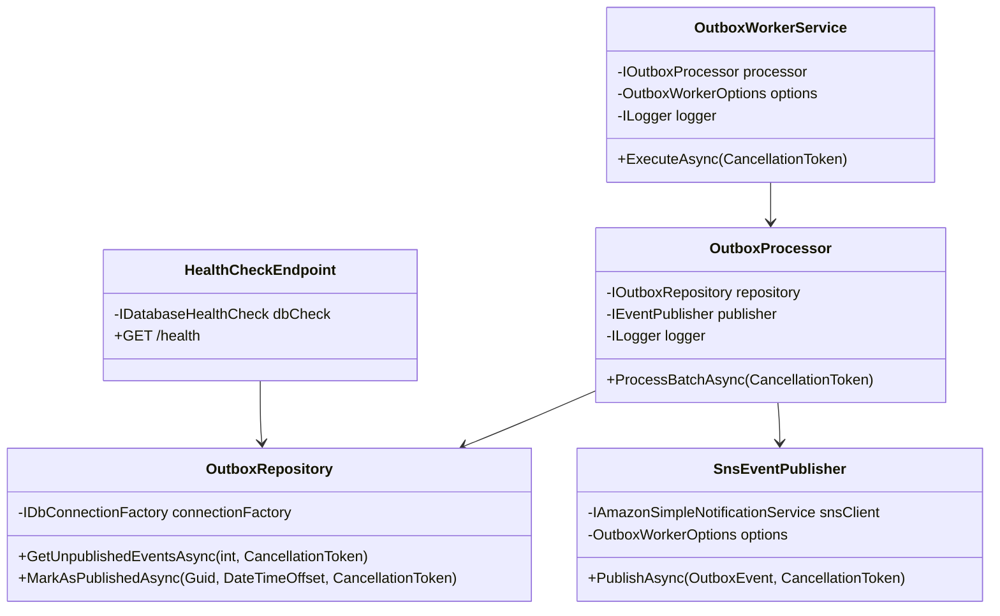

# Design Document: Event-Driven Outbox Worker

## Overview

The Event-Driven Outbox Worker is a .NET 8 BackgroundService application that implements the Transactional Outbox pattern for the CorePoints platform. It reliably bridges the gap between database-persisted events and SNS publication, ensuring at-least-once delivery without dual-writes.

A single codebase produces two deployment variants via environment configuration:
- **Ledger Outbox Worker** — polls the Ledger outbox table, publishes to `{env}-ledger-events-topic`
- **Product Outbox Worker** — polls the Product outbox table, publishes to `{env}-events-topic`

Each variant runs as an independent ECS Fargate task (0.25 vCPU / 0.5 GB RAM) in private subnets, completely isolated from API containers.

### Design Decisions

| Decision | Choice | Rationale |
|----------|--------|-----------|
| Runtime | .NET 8 BackgroundService | Native hosted service lifecycle, CancellationToken propagation, IHost graceful shutdown |
| DB Access | Dapper (async) | Project standard, lightweight, full async/CancellationToken support |
| Resilience | Polly v8 via Microsoft.Extensions.Http.Resilience | Standard per `11-resilience.md`, exponential backoff + circuit breaker |
| SNS Client | AWS SDK for .NET (AWSSDK.SimpleNotificationService) | Native, async, supports MessageDeduplicationId |
| Health | ASP.NET Core minimal API (`/health`) | Lightweight, integrates with ECS health checks |
| Logging | Serilog + JSON formatter | Structured JSON to stdout → CloudWatch Logs, per `07-observability.md` |
| Configuration | Environment variables + SSM Parameter Store | Externalized per-environment config, no redeployment needed |
| Deployment | ECS Fargate standalone tasks | Isolated from API services, private subnets only |

---

## Architecture



### Processing Flow (per polling cycle)



---

## Components and Interfaces

### 1. Program.cs (Host Configuration)

Configures the .NET Generic Host with:
- `BackgroundService` registration (the polling worker)
- Serilog JSON logging
- ASP.NET Core minimal API for `/health`
- Polly resilience pipelines
- DI registrations (repositories, SNS client, configuration)

### 2. OutboxWorkerService : BackgroundService

The main polling loop. Responsibilities:
- Executes on a configurable timer (`PollingInterval`)
- Delegates to `IOutboxProcessor` for batch processing
- Respects `CancellationToken` for graceful shutdown
- Logs configuration on startup

```csharp
public interface IOutboxWorkerService
{
    // Inherited from BackgroundService
    Task ExecuteAsync(CancellationToken stoppingToken);
}
```

### 3. IOutboxProcessor

Orchestrates a single polling cycle:
- Fetches a batch of unpublished events
- Publishes each event via `IEventPublisher`
- Acknowledges successful publications via `IOutboxRepository`

```csharp
public interface IOutboxProcessor
{
    Task<BatchResult> ProcessBatchAsync(CancellationToken cancellationToken);
}
```

### 4. IOutboxRepository

Database access layer (Dapper):
- Fetches unpublished events in order
- Marks events as published
- All methods async with CancellationToken

```csharp
public interface IOutboxRepository
{
    Task<IReadOnlyList<OutboxEvent>> GetUnpublishedEventsAsync(
        int batchSize, CancellationToken cancellationToken);
    
    Task MarkAsPublishedAsync(
        Guid eventId, DateTimeOffset publishedAt, CancellationToken cancellationToken);
}
```

### 5. IEventPublisher

SNS publication abstraction:
- Publishes a single event with deduplication ID
- Wraps the AWS SDK SNS client
- Polly resilience pipeline applied at this boundary

```csharp
public interface IEventPublisher
{
    Task<PublishResult> PublishAsync(
        OutboxEvent outboxEvent, CancellationToken cancellationToken);
}
```

### 6. IHealthCheckService

Health check logic:
- Validates database connectivity
- Returns healthy/unhealthy status

```csharp
public interface IDatabaseHealthCheck : IHealthCheck
{
    Task<HealthCheckResult> CheckHealthAsync(
        HealthCheckContext context, CancellationToken cancellationToken);
}
```

### 7. Configuration Classes

```csharp
public sealed class OutboxWorkerOptions
{
    public TimeSpan PollingInterval { get; init; } = TimeSpan.FromSeconds(5);
    public int BatchSize { get; init; } = 50;
    public string SnsTopicArn { get; init; } = string.Empty;
    public int MaxRetryAttempts { get; init; } = 3;
    public int HealthCheckPort { get; init; } = 8080;
    public TimeSpan ShutdownTimeout { get; init; } = TimeSpan.FromSeconds(30);
}
```

### Component Dependency Diagram



---

## Data Models

### OutboxEvent (Domain Model)

```csharp
public sealed record OutboxEvent
{
    public Guid Id { get; init; }
    public string EventType { get; init; } = string.Empty;
    public string Payload { get; init; } = string.Empty;
    public string CorrelationId { get; init; } = string.Empty;
    public DateTimeOffset CreatedAt { get; init; }
    public DateTimeOffset? PublishedAt { get; init; }
}
```

### Outbox Table Schema (PostgreSQL)

```sql
CREATE TABLE outbox_events (
    id              UUID PRIMARY KEY DEFAULT gen_random_uuid(),
    event_type      VARCHAR(100) NOT NULL,
    payload         JSONB NOT NULL,
    correlation_id  VARCHAR(100) NOT NULL,
    created_at      TIMESTAMPTZ NOT NULL DEFAULT NOW(),
    published_at    TIMESTAMPTZ NULL
);

CREATE INDEX idx_outbox_unpublished 
    ON outbox_events (created_at ASC) 
    WHERE published_at IS NULL;
```

### BatchResult (Internal)

```csharp
public sealed record BatchResult
{
    public int TotalFetched { get; init; }
    public int SuccessCount { get; init; }
    public int FailureCount { get; init; }
    public TimeSpan Duration { get; init; }
}
```

### PublishResult (Internal)

```csharp
public sealed record PublishResult
{
    public bool Success { get; init; }
    public string? MessageId { get; init; }
    public string? ErrorMessage { get; init; }
}
```

### SNS Message Structure (Ledger Events)

Following the Event Notification pattern per `18-ledger-core-architecture.md`:

```json
{
  "eventType": "TransactionRecorded",
  "transactionId": "uuid",
  "debitAccountId": "uuid",
  "creditAccountId": "uuid",
  "amount": 100.00,
  "timestamp": "2025-01-01T00:00:00Z",
  "correlationId": "X-Correlation-ID original"
}
```

### SNS Message Attributes

```json
{
  "MessageDeduplicationId": "outbox-event-uuid",
  "MessageAttributes": {
    "EventType": { "DataType": "String", "StringValue": "TransactionRecorded" },
    "CorrelationId": { "DataType": "String", "StringValue": "uuid" }
  }
}
```

### Configuration Environment Variables

| Variable | Description | Default |
|----------|-------------|---------|
| `OUTBOX_POLLING_INTERVAL_SECONDS` | Polling interval | `5` |
| `OUTBOX_BATCH_SIZE` | Events per batch | `50` |
| `OUTBOX_SNS_TOPIC_ARN` | Target SNS topic ARN | (required) |
| `OUTBOX_MAX_RETRY_ATTEMPTS` | Max retries per event per cycle | `3` |
| `OUTBOX_HEALTH_PORT` | Health check HTTP port | `8080` |
| `OUTBOX_SHUTDOWN_TIMEOUT_SECONDS` | Graceful shutdown timeout | `30` |
| `DATABASE_CONNECTION_STRING` | (from SSM at startup) | — |


---

## Correctness Properties

*A property is a characteristic or behavior that should hold true across all valid executions of a system — essentially, a formal statement about what the system should do. Properties serve as the bridge between human-readable specifications and machine-verifiable correctness guarantees.*

### Property 1: Event Ordering Invariant

*For any* set of unpublished outbox events in the database, the list returned by `GetUnpublishedEventsAsync` SHALL always be sorted in ascending order by `CreatedAt` timestamp.

**Validates: Requirements 1.1, 1.2**

### Property 2: Batch Size Limit

*For any* configured batch size B and any number of unpublished events N in the outbox table, `GetUnpublishedEventsAsync(B)` SHALL return at most B events (i.e., `result.Count <= B`).

**Validates: Requirements 1.5**

### Property 3: Publish-Per-Event Guarantee

*For any* batch of N events returned from the repository, the `OutboxProcessor` SHALL invoke `PublishAsync` exactly N times — once per event, in order.

**Validates: Requirements 2.1, 2.2**

### Property 4: Deduplication ID Correctness

*For any* outbox event, the SNS publish request SHALL contain a `MessageDeduplicationId` equal to the string representation of the event's unique identifier (`Id`).

**Validates: Requirements 2.3, 5.1**

### Property 5: Event Format Completeness

*For any* outbox event, the formatted SNS message body SHALL contain all required fields for its event type: for Ledger events (eventType, transactionId, debitAccountId, creditAccountId, amount, timestamp, correlationId); for Product events (eventType, entity identifier, correlationId).

**Validates: Requirements 2.4, 2.5**

### Property 6: Selective Acknowledgment

*For any* batch of outbox events where a subset S succeeds publication and a subset F fails, `MarkAsPublishedAsync` SHALL be called exactly once for each event in S and zero times for each event in F.

**Validates: Requirements 3.1, 3.2, 3.3**

### Property 7: Retry Attempt Limit

*For any* configured maximum retry count R, when an event persistently fails to publish, the total number of publish attempts for that event within a single polling cycle SHALL be at most R + 1 (1 initial attempt + R retries).

**Validates: Requirements 4.2**

### Property 8: CorrelationId Propagation

*For any* outbox event containing a correlationId, the published SNS message attributes SHALL include a `CorrelationId` attribute with the same value as the source event's correlationId field.

**Validates: Requirements 5.3**

### Property 9: Configuration Parsing with Defaults

*For any* valid positive integer value V set as an environment variable for a configuration property (polling interval, batch size, max retries), the resulting `OutboxWorkerOptions` SHALL contain V. When the environment variable is absent, the options SHALL contain the documented default value.

**Validates: Requirements 11.1, 11.2, 11.4**

---

## Error Handling

### SNS Publication Failures

| Scenario | Behavior |
|----------|----------|
| Transient error (timeout, 5xx, throttle) | Retry with exponential backoff + jitter (Polly). Max attempts configurable (default: 3). |
| Persistent failure (max retries exhausted) | Log error with event ID, error details, attempt count. Leave event unmarked for next cycle. |
| Invalid message (4xx, validation error) | Log error. Leave event unmarked. Will be retried next cycle (may need manual intervention if payload is malformed). |

### Database Failures

| Scenario | Behavior |
|----------|----------|
| Connection failure during polling | Log error. Wait for next polling interval. No crash. |
| Connection failure during mark-as-published | Log error. Event remains unmarked. Will be re-published next cycle (idempotent via deduplication ID). |
| Query timeout | Handled by Polly timeout policy. Logged. Next cycle retries. |

### Shutdown Edge Cases

| Scenario | Behavior |
|----------|----------|
| SIGTERM during idle (between polls) | Exit immediately with code 0. |
| SIGTERM during batch processing | Complete current batch, then exit with code 0. |
| Shutdown timeout exceeded | Force terminate. Log warning. Exit code ≠ 0. ECS will restart. |

### Resilience Pipeline Configuration (Polly v8)

```csharp
// SNS Publish resilience pipeline
services.AddResiliencePipeline("sns-publish", builder =>
{
    builder
        .AddRetry(new RetryStrategyOptions
        {
            MaxRetryAttempts = options.MaxRetryAttempts,
            BackoffType = DelayBackoffType.Exponential,
            UseJitter = true,
            Delay = TimeSpan.FromMilliseconds(200),
            ShouldHandle = new PredicateBuilder()
                .Handle<AmazonSimpleNotificationServiceException>(ex => ex.StatusCode >= HttpStatusCode.InternalServerError)
                .Handle<TaskCanceledException>()
                .Handle<HttpRequestException>()
        })
        .AddTimeout(TimeSpan.FromSeconds(10));
});

// Database resilience pipeline
services.AddResiliencePipeline("database", builder =>
{
    builder
        .AddRetry(new RetryStrategyOptions
        {
            MaxRetryAttempts = 2,
            BackoffType = DelayBackoffType.Exponential,
            UseJitter = true,
            Delay = TimeSpan.FromMilliseconds(100),
            ShouldHandle = new PredicateBuilder()
                .Handle<NpgsqlException>(ex => ex.IsTransient)
                .Handle<TimeoutException>()
        })
        .AddTimeout(TimeSpan.FromSeconds(5));
});
```

---

## Testing Strategy

### Property-Based Testing (PBT)

This feature is suitable for property-based testing because it contains pure logic components with clear input/output behavior and universal properties that hold across a wide input space.

**Library:** [FsCheck](https://fscheck.github.io/FsCheck/) with xUnit integration (`FsCheck.Xunit`)

**Configuration:** Minimum 100 iterations per property test.

**Tag format:** `Feature: event-driven-outbox-worker, Property {number}: {property_text}`

#### Property Tests to Implement

| Property | Component Under Test | Generator Strategy |
|----------|---------------------|-------------------|
| 1: Event Ordering | `OutboxRepository.GetUnpublishedEventsAsync` | Random outbox events with varying timestamps |
| 2: Batch Size Limit | `OutboxRepository.GetUnpublishedEventsAsync` | Random batch sizes (1-500) × random event counts |
| 3: Publish-Per-Event | `OutboxProcessor.ProcessBatchAsync` | Random batch sizes with mock publisher |
| 4: Deduplication ID | `SnsEventPublisher.PublishAsync` | Random GUIDs as event IDs |
| 5: Event Format | `SnsEventPublisher` message builder | Random event payloads (Ledger + Product types) |
| 6: Selective Acknowledgment | `OutboxProcessor.ProcessBatchAsync` | Random batches with random success/failure patterns |
| 7: Retry Limit | `OutboxProcessor` with failing publisher | Random max retry configs (1-10) |
| 8: CorrelationId Propagation | `SnsEventPublisher.PublishAsync` | Random correlationId strings |
| 9: Configuration Parsing | `OutboxWorkerOptions` binding | Random valid integer values for each config property |

### Unit Tests (Example-Based)

| Area | Tests |
|------|-------|
| Configuration defaults | Verify default values when env vars are absent |
| Empty batch behavior | Verify no publish calls when no events exist |
| Health check healthy | Verify HTTP 200 when DB is reachable |
| Health check unhealthy | Verify HTTP 503 when DB is unreachable |
| Graceful shutdown — stops polling | Verify no new cycles after cancellation |
| Graceful shutdown — completes batch | Verify in-progress batch finishes |
| Startup logging | Verify config values are logged at startup |
| DB failure during poll | Verify error logged, no crash, next interval waits |

### Integration Tests

| Area | Tests |
|------|-------|
| RDS Proxy connectivity | Verify connection to PostgreSQL via RDS Proxy |
| SSM Parameter Store | Verify connection string retrieval at startup |
| SNS publish end-to-end | Verify message arrives in SNS topic with correct attributes |
| Full polling cycle | Start worker, insert event in DB, verify published to SNS and marked |

### Smoke Tests

| Area | Tests |
|------|-------|
| ECS task definition | Verify 0.25 vCPU / 0.5 GB RAM configuration |
| Private subnet deployment | Verify no public IP assignment |
| IAM policies | Verify SNS publish scoped to specific topic, SSM read scoped to environment path |
| Polly registration | Verify resilience pipelines are registered in DI |
| Serilog JSON format | Verify log output is valid JSON |
