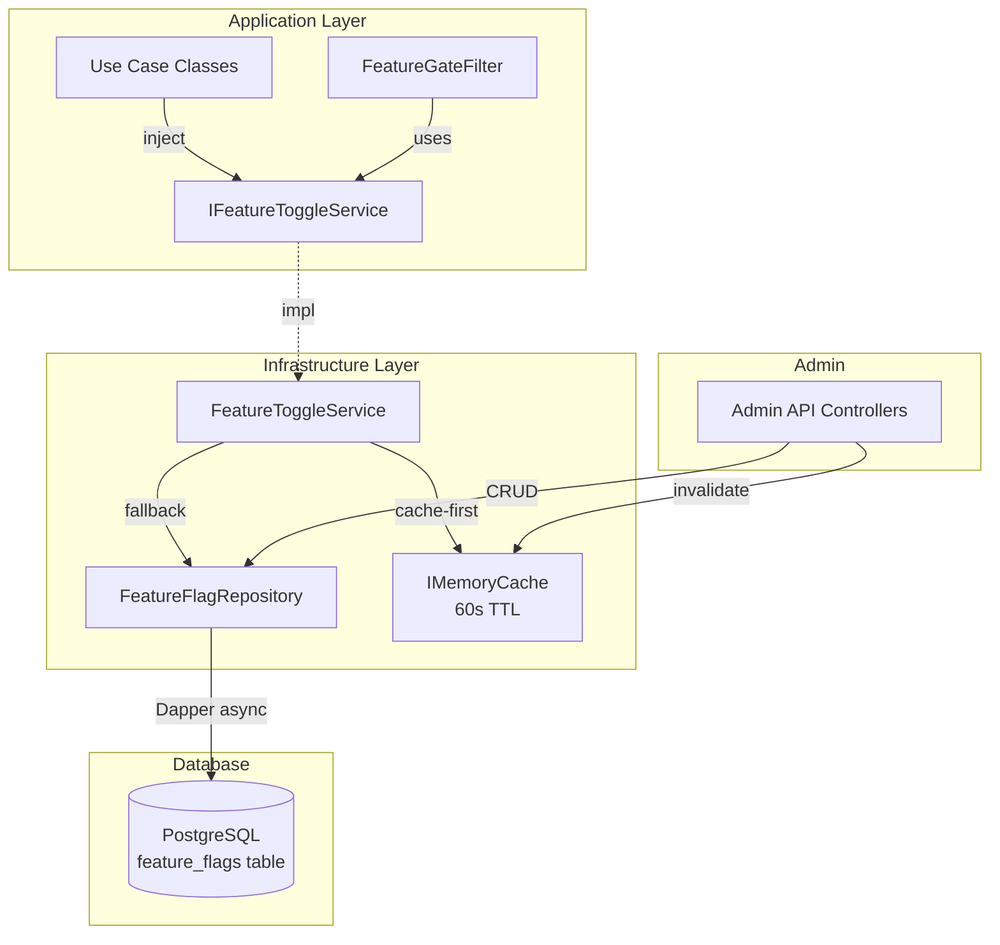
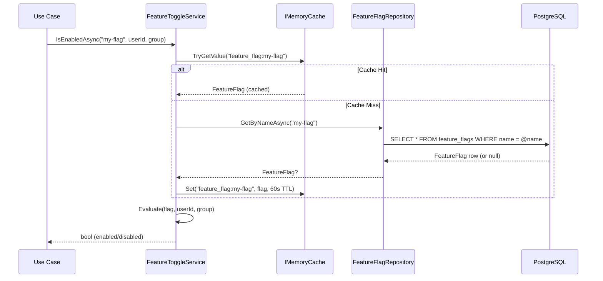

# Design Document: Feature Toggles System

## Overview

The Feature Toggles System provides a centralized, database-backed mechanism for controlling feature visibility at runtime in the CorePoints platform. It follows the governance mandate that every new feature must be behind a feature flag, with flag evaluation occurring exclusively at the Use Case layer.

The system consists of:
- A PostgreSQL `feature_flags` table (accessed via Dapper) as the source of truth
- An in-memory cache (IMemoryCache, 60s TTL) to minimize DB hits
- An `IFeatureToggleService` interface for flag evaluation in application code
- A REST Admin API for CRUD operations on flags
- An endpoint filter/attribute for declarative flag-gating of routes
- Canary release support via target_groups (JSONB array of group names)

### Design Decisions

| Decision | Choice | Rationale |
|----------|--------|-----------|
| Storage | PostgreSQL table via Dapper | Governance standard, no external service needed, simple and auditable |
| Cache | IMemoryCache with 60s TTL | Low latency, no infrastructure dependency, acceptable staleness window |
| Evaluation Layer | Use Case (Application Layer) | Per governance: never expose flag logic to frontend |
| Cache Invalidation | Immediate on Admin API write + TTL expiry | Ensures admin changes take effect quickly while maintaining cache benefits |
| Fail-Closed | Return false on errors | Safety: if we can't evaluate, feature stays off |
| Admin API | Simple REST (no auth in this spec) | Focused on flag management; auth delegated to API Gateway per 06-api-gateway.md |
| Filter | IEndpointFilter + Attribute | .NET 8 minimal API native, composable, testable |

---

## Architecture



### Flag Evaluation Flow



---

## Components and Interfaces

### 1. IFeatureToggleService (Public Interface)

The contract consumed by Use Case classes and the endpoint filter.

```csharp
public interface IFeatureToggleService
{
    Task<bool> IsEnabledAsync(string flagName, string? userId = null, string? group = null, CancellationToken cancellationToken = default);
}
```

### 2. FeatureToggleService (Implementation)

Cache-first evaluation with DB fallback. Fail-closed on errors.

```csharp
public sealed class FeatureToggleService : IFeatureToggleService
{
    private readonly IFeatureFlagRepository _repository;
    private readonly IMemoryCache _cache;
    private readonly ILogger<FeatureToggleService> _logger;
    private readonly FeatureToggleOptions _options;

    public async Task<bool> IsEnabledAsync(string flagName, string? userId, string? group, CancellationToken cancellationToken)
    {
        // 1. Try cache
        // 2. On miss, query repository
        // 3. Store in cache with TTL
        // 4. Evaluate: is_enabled + target_groups matching
        // 5. On any error, return false and log
    }
}
```

### 3. IFeatureFlagRepository (Data Access Interface)

```csharp
public interface IFeatureFlagRepository
{
    Task<FeatureFlag?> GetByNameAsync(string name, CancellationToken cancellationToken);
    Task<IReadOnlyList<FeatureFlag>> GetAllAsync(CancellationToken cancellationToken);
    Task<FeatureFlag> CreateAsync(CreateFeatureFlagRequest request, CancellationToken cancellationToken);
    Task<FeatureFlag?> UpdateAsync(string name, UpdateFeatureFlagRequest request, CancellationToken cancellationToken);
    Task<bool> DeleteAsync(string name, CancellationToken cancellationToken);
}
```

### 4. FeatureFlagRepository (Dapper Implementation)

```csharp
public sealed class FeatureFlagRepository : IFeatureFlagRepository
{
    private readonly IDbConnectionFactory _connectionFactory;

    // All methods use Dapper async with CancellationToken
    // JSONB target_groups mapped via Dapper type handler
}
```

### 5. FeatureGateAttribute + FeatureGateFilter

Declarative endpoint gating using .NET 8 endpoint filters.

```csharp
[AttributeUsage(AttributeTargets.Method | AttributeTargets.Class)]
public sealed class FeatureGateAttribute : Attribute
{
    public string FlagName { get; }
    public FeatureGateAttribute(string flagName) => FlagName = flagName;
}

public sealed class FeatureGateFilter : IEndpointFilter
{
    public async ValueTask<object?> InvokeAsync(EndpointFilterInvocationContext context, EndpointFilterDelegate next)
    {
        // 1. Read FlagName from attribute/metadata
        // 2. Extract userId/group from HttpContext.User claims
        // 3. Call IFeatureToggleService.IsEnabledAsync
        // 4. If disabled → return 404
        // 5. If enabled → await next(context)
    }
}
```

### 6. Admin API Endpoints

```csharp
// GET /admin/flags → List all flags
// POST /admin/flags → Create flag (body: CreateFeatureFlagRequest)
// PUT /admin/flags/{name} → Update flag (body: UpdateFeatureFlagRequest)
// DELETE /admin/flags/{name} → Delete flag
```

### 7. Configuration

```csharp
public sealed class FeatureToggleOptions
{
    public TimeSpan CacheTtl { get; init; } = TimeSpan.FromSeconds(60);
    public string ConnectionString { get; init; } = string.Empty;
}
```

---

## Data Models

### FeatureFlag (Domain Model)

```csharp
public sealed record FeatureFlag
{
    public Guid Id { get; init; }
    public string Name { get; init; } = string.Empty;
    public string? Description { get; init; }
    public bool IsEnabled { get; init; }
    public List<string> TargetGroups { get; init; } = new();
    public DateTimeOffset CreatedAt { get; init; }
    public DateTimeOffset UpdatedAt { get; init; }
}
```

### CreateFeatureFlagRequest

```csharp
public sealed record CreateFeatureFlagRequest
{
    public string Name { get; init; } = string.Empty;
    public string? Description { get; init; }
    public bool IsEnabled { get; init; } = false;
    public List<string>? TargetGroups { get; init; }
}
```

### UpdateFeatureFlagRequest

```csharp
public sealed record UpdateFeatureFlagRequest
{
    public string? Description { get; init; }
    public bool? IsEnabled { get; init; }
    public List<string>? TargetGroups { get; init; }
}
```

### Database Schema

```sql
CREATE TABLE feature_flags (
    id              UUID PRIMARY KEY DEFAULT gen_random_uuid(),
    name            VARCHAR(200) NOT NULL UNIQUE,
    description     TEXT,
    is_enabled      BOOLEAN NOT NULL DEFAULT FALSE,
    target_groups   JSONB NOT NULL DEFAULT '[]'::jsonb,
    created_at      TIMESTAMPTZ NOT NULL DEFAULT NOW(),
    updated_at      TIMESTAMPTZ NOT NULL DEFAULT NOW()
);

CREATE UNIQUE INDEX idx_feature_flags_name ON feature_flags (name);
```

### Admin API Response (Problem Details)

```json
{
  "type": "https://tools.ietf.org/html/rfc7807",
  "title": "Conflict",
  "status": 409,
  "detail": "A feature flag with name 'my-flag' already exists."
}
```

---

## Correctness Properties

### Property 1: Flag Evaluation — Disabled Flag Always Returns False

*For any* Feature_Flag where is_enabled is false, `IsEnabledAsync` SHALL return false regardless of userId or group values provided.

**Validates: Requirement 2.3**

### Property 2: Flag Evaluation — Enabled Flag Without Target Groups Returns True

*For any* Feature_Flag where is_enabled is true and target_groups is empty or null, `IsEnabledAsync` SHALL return true for any userId and group combination.

**Validates: Requirement 2.4**

### Property 3: Flag Evaluation — Group Matching

*For any* Feature_Flag where is_enabled is true and target_groups contains entries, `IsEnabledAsync` SHALL return true if and only if the provided group is contained in target_groups.

**Validates: Requirements 2.5, 2.6, 10.2, 10.3, 10.4**

### Property 4: Flag Not Found Returns False

*For any* flag name that does not exist in the repository, `IsEnabledAsync` SHALL return false.

**Validates: Requirement 2.2**

### Property 5: Cache Consistency — Read After Write

*For any* Feature_Flag created or updated via the Admin_API, a subsequent `IsEnabledAsync` call SHALL reflect the new state (cache invalidation on write).

**Validates: Requirements 3.4**

### Property 6: Cache-First Behavior

*For any* cached Feature_Flag, `IsEnabledAsync` SHALL return the result without invoking the Flag_Repository (within TTL window).

**Validates: Requirement 3.1**

### Property 7: Fail-Closed on Repository Error

*For any* repository failure during evaluation, `IsEnabledAsync` SHALL return false.

**Validates: Requirement 11.1**

### Property 8: Admin CRUD Round-Trip

*For any* valid CreateFeatureFlagRequest, creating a flag then reading it back SHALL return an equivalent object with matching name, description, is_enabled, and target_groups.

**Validates: Requirements 1.4, 4.1, 5.1**

### Property 9: Unique Name Constraint

*For any* two CreateFeatureFlagRequests with the same name, the second create SHALL fail with HTTP 409.

**Validates: Requirement 5.2**

---

## Error Handling

### Flag Evaluation Errors

| Scenario | Behavior |
|----------|----------|
| Repository unreachable | Return false (fail-closed), log error |
| Cache error | Fall through to repository |
| Flag not found | Return false |
| Invalid group claim | Treat as no group, evaluate accordingly |

### Admin API Errors

| Scenario | HTTP Status | Problem Details |
|----------|-------------|-----------------|
| Flag name already exists (POST) | 409 Conflict | "A feature flag with name '{name}' already exists." |
| Flag not found (PUT/DELETE) | 404 Not Found | "Feature flag '{name}' not found." |
| Missing required field (POST) | 400 Bad Request | "The 'name' field is required." |
| Database error | 500 Internal Server Error | "An internal error occurred." (no stack trace) |

---

## Testing Strategy

### Property-Based Testing (PBT)

**Library:** FsCheck with xUnit integration (`FsCheck.Xunit`)
**Configuration:** Minimum 100 iterations per property test.
**Tag format:** `Feature: feature-toggles-system, Property {number}: {property_text}`

| Property | Component Under Test | Generator Strategy |
|----------|---------------------|-------------------|
| 1: Disabled flag returns false | `FeatureToggleService.IsEnabledAsync` | Random flag names, random userId/group, is_enabled=false |
| 2: Enabled no groups returns true | `FeatureToggleService.IsEnabledAsync` | Random enabled flags with empty target_groups, random userId/group |
| 3: Group matching | `FeatureToggleService.IsEnabledAsync` | Random enabled flags with random target_groups, random group values |
| 4: Not found returns false | `FeatureToggleService.IsEnabledAsync` | Random non-existent flag names |
| 7: Fail-closed | `FeatureToggleService.IsEnabledAsync` | Random flags with repository throwing exceptions |
| 8: CRUD round-trip | `FeatureFlagRepository` | Random valid CreateFeatureFlagRequests |
| 9: Unique name constraint | `Admin API / Repository` | Pairs of requests with identical names |

### Unit Tests (Example-Based)

| Area | Tests |
|------|-------|
| Cache hit path | Verify no repository call when cache has entry |
| Cache miss path | Verify repository called and cache populated |
| Cache invalidation on create | Verify cache entry removed after create |
| Cache invalidation on update | Verify cache entry removed after update |
| Cache invalidation on delete | Verify cache entry removed after delete |
| Filter returns 404 when flag disabled | Mock service returns false |
| Filter passes through when flag enabled | Mock service returns true |
| Filter extracts user claims | Verify userId/group from ClaimsPrincipal |
| Admin POST 201 | Valid request creates flag |
| Admin POST 409 | Duplicate name returns conflict |
| Admin POST 400 | Missing name returns bad request |
| Admin PUT 200 | Valid update returns updated flag |
| Admin PUT 404 | Non-existent flag returns not found |
| Admin DELETE 204 | Existing flag returns no content |
| Admin DELETE 404 | Non-existent flag returns not found |
| Admin GET 200 | Returns all flags |

### Integration Tests

| Area | Tests |
|------|-------|
| Repository CRUD | Full lifecycle against PostgreSQL (test container) |
| JSONB target_groups | Verify round-trip of string arrays through JSONB |
| Cache TTL expiry | Verify cache expires after configured TTL |
| End-to-end evaluation | Create flag via Admin API, evaluate via service |
